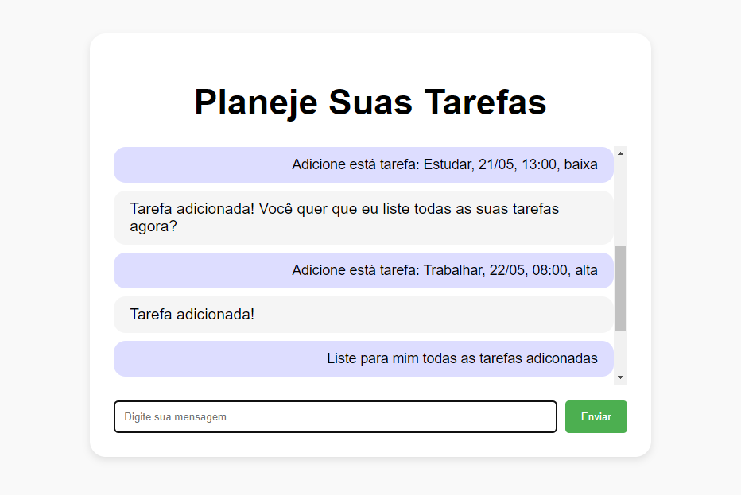
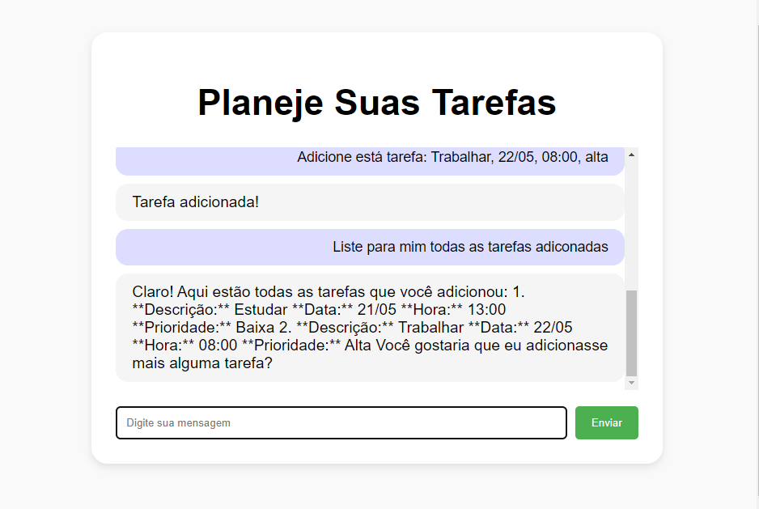

# Planeje Suas Tarefas - To Do List Inteligente

## Requisitos
1. `npm install`
2. Crie um arquivo `.env` e adicione sua chave de API como:
     ```
     API_KEY="Cole sua chave de API aqui"
     ```

### Requisitos de Software
- `node --version` # Deve ser >= 18

### Execução do Servidor
Para iniciar o servidor, execute o seguinte comando no terminal:  `node server.js`

- A porta de acesso no navegador é: `localhost:3000`


## Objetivo
Auxiliar o usuário na organização e gerenciamento de suas tarefas diárias, permitindo que ele:

- Adicione novas tarefas: Informando a descrição, data, hora e nível de prioridade.
- Visualize todas as tarefas: Em ordem de prioridade (alta para baixa).
- Consulte tarefas específicas: Através de comandos como "listar tarefas".
- Remova tarefas
- Mantenha o histórico de tarefas: Todas as tarefas adicionadas são salvas e podem ser consultadas posteriormente

- Com todas as funcionalidades que o gemini consegue entregar para o usuário


## Página do projeto


